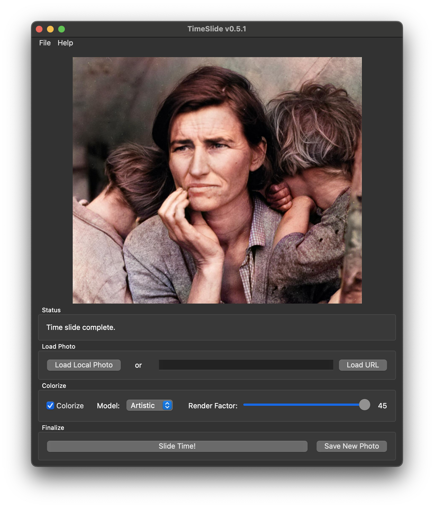

__a super-simple gui to slide old photographs into TODAY__

TimeSlide is a prototype concept to balance the ease of applying machine-learning colorizing and up-sampling of old photographs without having to possess coding expertise or uploading your photographs to an online service. It is inspired by my desire to provide an easy-to-use *offline* option for my mother with her older family and ancestral photos. The goal is to give the people a secure and easy way to make your old photos look like they were taken today. The application name is derived from the title of an episode of the amazing British sitcom, "[Red Dwarf](https://www.reddwarf.co.uk/news/index.cfm)," wherein [timeslides](https://en.wikipedia.org/wiki/Timeslides) provided much more interactive features of old photographs.



TimeSlide is really just an attempt at pretty packaging of the hard work by others--e.g., the [deoldify](https://github.com/jantic/DeOldify) project, torch developers and all the other selfless contributors to both the open source and free software communities that provide enabling technologies.

__Importantly, TimeSlide targets macOS.__ Currently, since it is based solely on python modules, you could certainly bundle a Windows application. But no support on that procedure is provided herein (though you're welcome to figure it out yourself and submit a PR). I haven't gone through all licenses yet and so do not provide a "release" here. But the instructions for bundling/packaging a distribution yourself is provided herein.

## Requirements
- macOS (tested with Monterey 12.0.1)
- brew
- python 3.9

## Setup for Development

In macOS, install [homebrew](https://brew.sh). Then, use it to install Python 3.9.
```
brew install python@3.9
```

Link it in your path with 
```
echo 'export PATH="/usr/local/opt/python@3.9/bin:$PATH"' >> ~/.zshrc
```

Ensure that the `python3` command is correctly inked to the homebrew version with
```
which python3
```

Also verify here that it is python 3.9, or else just run `python3 --version` to confirm.

Next, run the bootstrap file which will clone deoldify, download the colorizing models, install a few packages through homebrew, and install all python requirements in a virtual environment. Edit it if you desire or require, then run
```
source bootstrap.sh
```

## Execute TimeSlide for Development

After activating the python virtual environment (`source venv/bin/activate`), simply run the python script:
```
python timeslide.py
```

## Bundle for macOS

Since the whole point of TimeSlide is ease of use, we require a solution for bundling the app that can be distributed to others. To do this, first open the file `timeslide.spec` and ensure that the path to your homebrew (Cellar'ed) version of `libpng16.16.dylib` is correct (slight modifications may be necessary depending on version number.) 

Next, in terminal, run:
```
source bundle.sh
```

With this, pyinstaller will bundle the app, including all necessary python modules, dynamic libraries, and machine learning models (pretrained weights). It will be bundled into a single `.app` bundle (as well as a binary executable) under the `dist` folder. Additionally, the bash script will copy over the icon files into the `.app` file. I recommend running the binary executable first to troubleshoot, as you'll be able to see any errors that occur. 

## Running the Bundled macOS App

Please note that distributing the application to others will require that they enable unidentified developer apps (one-time procedure) to run on any somewhat recent versions of macOS. This can be done by providing those users with the following instructions.

1. Press `⌘` + `SPACEBAR`.
2. Type `term`. When the Terminal.app shows, click it (or hit `ENTER`).
3. In the window, type `sudo spctl --master-disable` (note double hyphens before `master`), hit `ENTER`.
4. Enter password as required, hit `ENTER`.
5. Open System Preferences.
6. Click "Security and Privacy." Make sure you're on the "General" tab.
7. Click the lock at the bottom left, and enter password.
8. Under "Allow apps downloaded from," ensure that "Anywhere" is selected.
9. Close System Preferences and double-click the TimeSlide app to run.

## Release Notes

### v0.5 (2022.03.31)
- complete rewrite of gui in pyqt6
- enable URL loading
- removed enhancement as implementation was far too slow

### v0.4.2 (2022.02.14)
- updated deoldify models to current urls
- accepted dependabot PRs for various vulnerabilities

### v0.4.1 (2021.07.29)
- updated several module versions for security and compatibility

### v0.4 (2020.08.28)
- default window width enlarged for better viewing
- image now maintains aspect ratio correctly in canvas
- resizing window now resizes canvas and image
- dropdown menus now have correct background color
- removed many unncessary python modules from bundle
- window now will start in center of the screen
- app will no longer fail when user cancels load file

### v0.3 (2020.08.17)
- new enhancement frame (including tooltips)
- enhancement allows for 4 models, 3 multiplicative factors each

### v0.2 (2020.07.05)

- `.jpg` now default when saving
- status updates now provided during procedure
- tooltips now help guide user
- blurry text in macOS resolved
- dedicated icon
- stable model + artistic model both included
- app can now be fully bundled for macOS

### v0.1 (2020.06.08)

- first working version
- colorize-capable (and optional)
- render factor selection on colorize
- load from local file or url
- gui layout to guide user

## Useful Links

If you just want to test out TimeSlide but don't have black-and-white photos available, here are some nice resources:

- [the way we were](https://www.reddit.com/r/TheWayWeWere/)
- [library of congress free-to-use](https://www.loc.gov/free-to-use/)
- [pexels: black and white](https://www.pexels.com/search/black%20and%20white/)s